# CST8918-W25-Lab12

## Team Members
- **Shaoxian Duan** (GitHub: [shaoxian423](https://github.com/shaoxian423))
- **Xihai Ren** (GitHub: [RyanRen2023](https://github.com/RyanRen2023))
- **Mishravaibhav0032** (GitHub: ...)

**Date:** July 30, 2025

---

## Table of Contents
1. [Project Setup](#project-setup)
2. [Terraform Backend Configuration](#terraform-backend-configuration)
3. [Azure Credentials Setup](#azure-credentials-setup)
4. [GitHub Secrets Configuration](#github-secrets-configuration)
5. [GitHub Actions Workflows](#github-actions-workflows)
6. [Workflow Results](#workflow-results)

---

## Project Setup

### 1.1 Create Project Structure

```bash
# Create directories
mkdir -p .github/workflows
mkdir -p app
mkdir -p infra/tf-app
mkdir -p infra/tf-backend
mkdir -p infra/az-federated-credential-params
mkdir -p screenshots

# Create files
touch app/.gitkeep
touch infra/tf-app/.tflint.hcl
touch infra/tf-app/main.tf
touch infra/tf-app/outputs.tf
touch infra/tf-app/terraform.tf
touch infra/tf-app/variables.tf
touch infra/tf-backend/main.tf
touch infra/az-federated-credential-params/branch-main.json
touch infra/az-federated-credential-params/production-deploy.json
touch infra/az-federated-credential-params/pull-request.json
touch .editorconfig
touch .gitignore
touch README.md

# Create GitHub Actions workflows files
touch .github/workflows/infra-static-tests.yml
touch .github/workflows/infra-ci-cd.yml
touch .github/workflows/infra-drift-detection.yml
```

---

## Terraform Backend Configuration

### 2.1 Backend Infrastructure (`infra/tf-backend/main.tf`)

```hcl
terraform {
  required_providers {
    azurerm = {
      source  = "hashicorp/azurerm"
      version = "~> 3.0"
    }
  }

  required_version = ">= 1.1.0"
}

provider "azurerm" {
  features {}
  use_oidc = true  # Enable OIDC authentication for GitHub Actions
}

resource "azurerm_resource_group" "rg" {
  name     = "duan0027-githubactions-rg"
  location = "Canada Central"
}

resource "azurerm_storage_account" "sa" {
  name                     = "duan0027githubactions25"  # Unique name
  resource_group_name      = azurerm_resource_group.rg.name
  location                 = azurerm_resource_group.rg.location
  account_tier             = "Standard"
  account_replication_type = "LRS"
  min_tls_version          = "TLS1_2"
}

resource "azurerm_storage_container" "tfstate" {
  name                  = "tfstate"
  storage_account_name  = azurerm_storage_account.sa.name
  container_access_type = "private"
}

output "resource_group_name" {
  value = azurerm_resource_group.rg.name
}

output "storage_account_name" {
  value = azurerm_storage_account.sa.name
}

output "container_name" {
  value = azurerm_storage_container.tfstate.name
}

output "arm_access_key" {
  value     = azurerm_storage_account.sa.primary_access_key
  sensitive = true
}
```

### 2.2 Deploy Backend Infrastructure

```bash
cd infra/tf-backend
terraform init
terraform fmt
terraform validate
terraform plan -out=tf-backend.plan
terraform apply tf-backend.plan
export ARM_ACCESS_KEY=$(terraform output -raw arm_access_key)
```

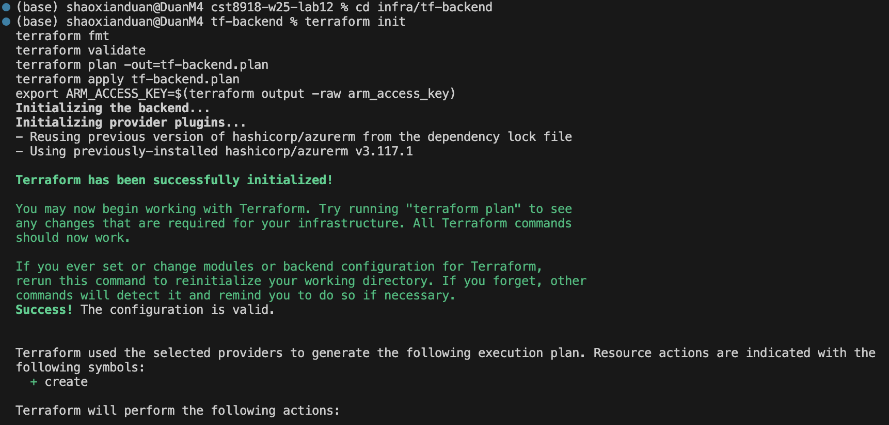
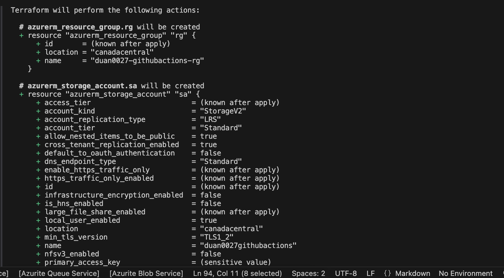
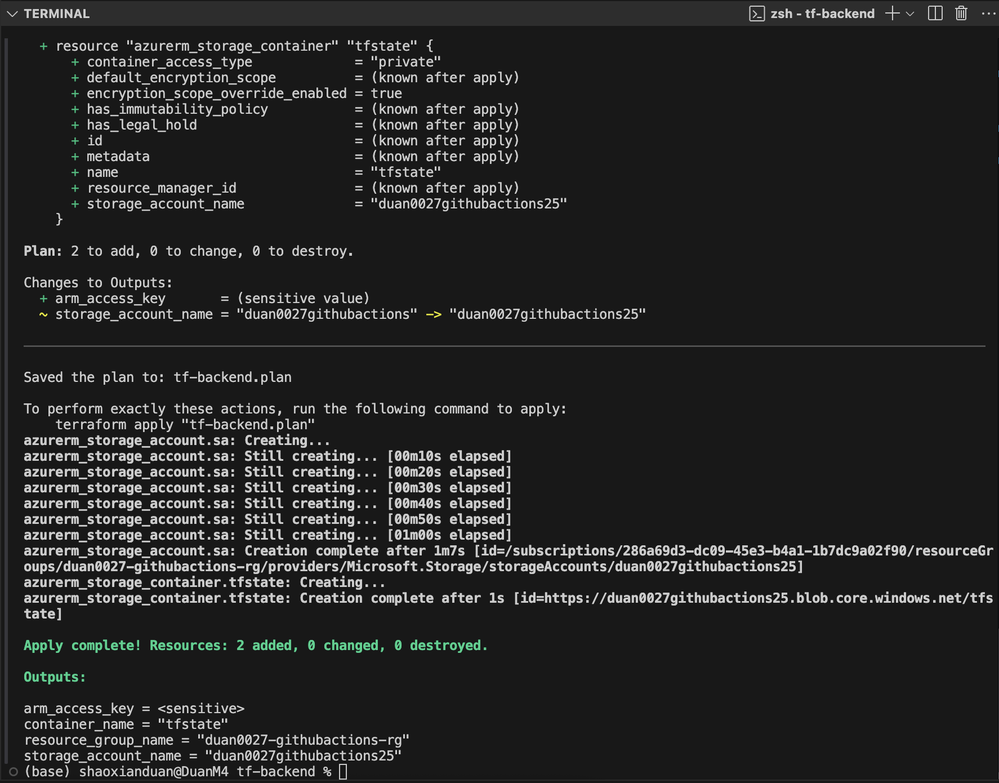

### 2.3 Application Infrastructure (`infra/tf-app/terraform.tf`)

```hcl
terraform {
  required_providers {
    azurerm = {
      source  = "hashicorp/azurerm"
      version = "~> 3.0"
    }
  }

  backend "azurerm" {
    resource_group_name  = "duan0027-githubactions-rg"
    storage_account_name = "duan0027githubactions25"
    container_name       = "tfstate"
    key                  = "terraform.tfstate"
  }
}

provider "azurerm" {
  features {}
  use_oidc = true # Enable OIDC
}
```

### 2.4 Application Resources (`infra/tf-app/main.tf`)

```hcl
resource "azurerm_resource_group" "app_rg" {
  name     = "duan0027-a12-rg"
  location = "Canada Central"
}
```

### 2.5 Deploy Application Infrastructure

```bash
cd ../tf-app/
terraform init -reconfigure
terraform fmt
terraform validate
terraform plan -out=tf-app.plan
terraform apply tf-app.plan
```

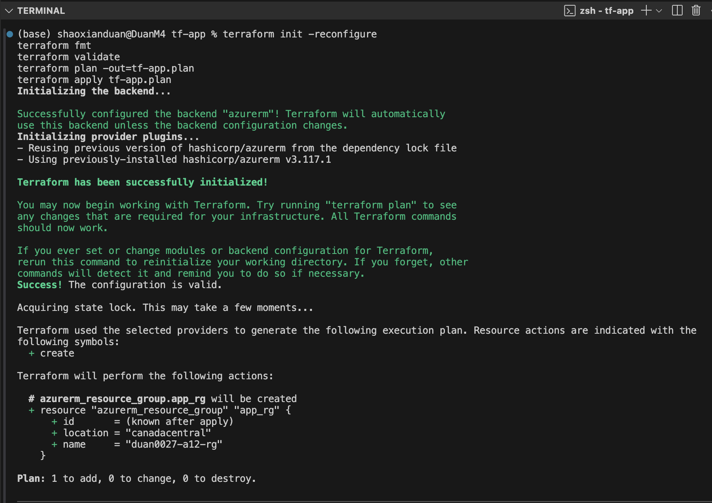
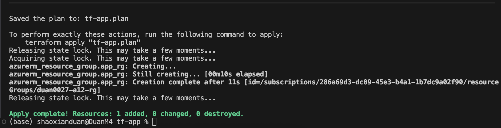

---

## Azure Credentials Setup

### 3.1 Get Azure Subscription Information

```bash
export subscriptionId=$(az account show --query id -o tsv)
export tenantId=$(az account show --query tenantId -o tsv)

echo $subscriptionId 
echo $tenantId
```

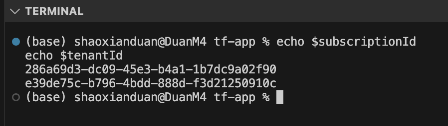

```bash
export resourceGroupName=$(terraform output -raw resource_group_name)
export resourceGroupName="duan0027-a12-rg"
```

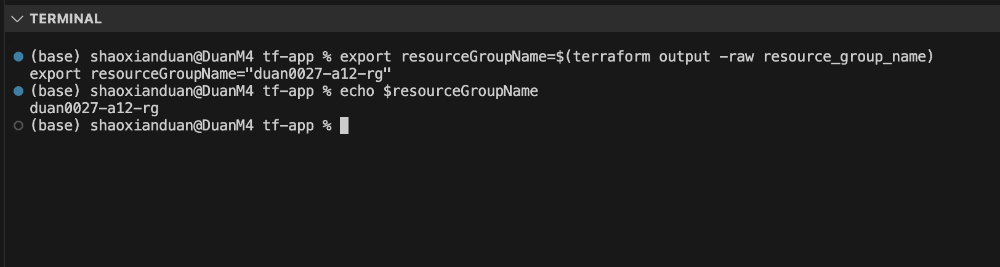

### 3.2 Create Azure AD Applications

#### Create Read-Write Application

```bash
# Create Azure AD application
az ad app create --display-name duan0027-githubactions-rw
```


```bash
# Set environment variables
export subscriptionId=286a69d3-dc09-45e3-b4a1-1b7dc9a02f90
export tenantId=e39de75c-b796-4bdd-888d-f3d21250910c
export resourceGroupName=duan0027-a12-rg
export appIdRW=3b3dd36a-923d-4b7c-8831-0a95804e5cab

# Create service principal
az ad sp create --id $appIdRW
```

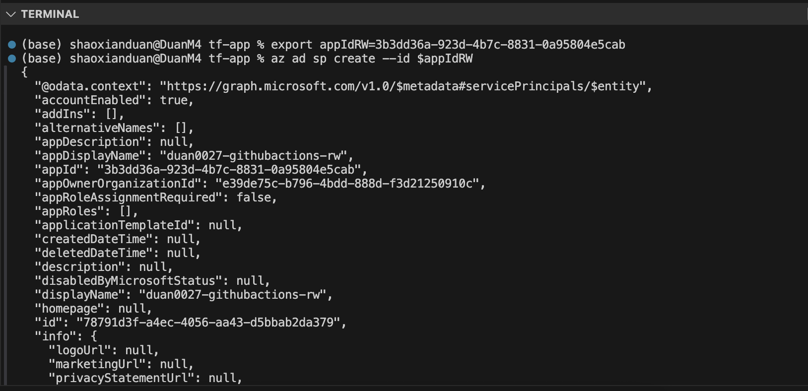

```bash
# Get object ID
export assigneeObjectId=$(az ad sp show --id $appIdRW --query id -o tsv)
echo $assigneeObjectId
```

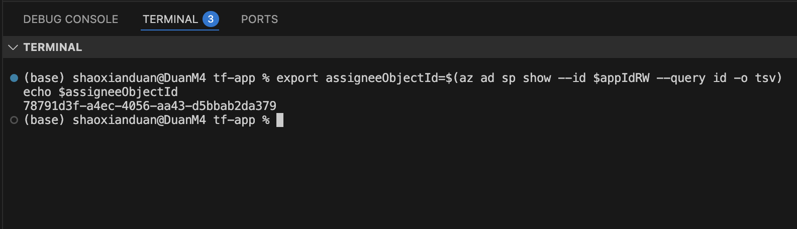

```bash
# Assign Contributor role
az role assignment create \
  --role contributor \
  --subscription $subscriptionId \
  --assignee-object-id $assigneeObjectId \
  --assignee-principal-type ServicePrincipal \
  --scope /subscriptions/$subscriptionId/resourceGroups/$resourceGroupName
```

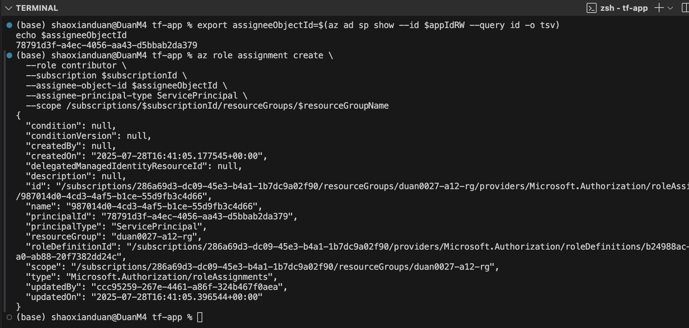

```bash
# Verify role assignment
az role assignment list --scope /subscriptions/$subscriptionId/resourceGroups/$resourceGroupName --query "[?roleDefinitionName=='Contributor'].{Principal:principalName}" -o table
```

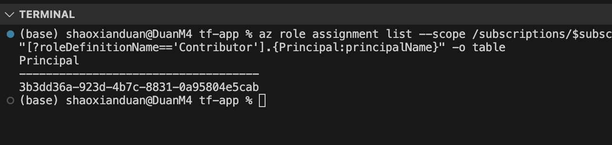

#### Create Read-Only Application

```bash
# Create read-only application
az ad app create --display-name duan0027-githubactions-r
```

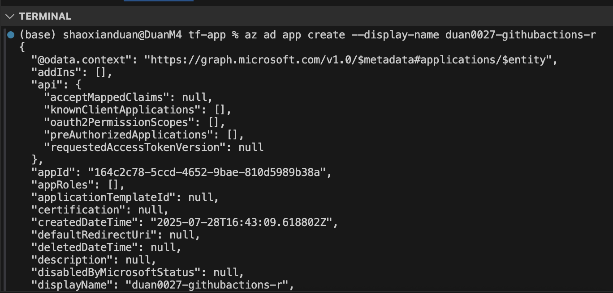

```bash
export appIdR=164c2c78-5ccd-4652-9bae-810d5989b38a

# Create service principal
az ad sp create --id $appIdR
```

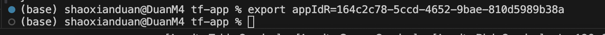

```bash
export assigneeObjectId=$(az ad sp show --id $appIdR --query id -o tsv)
echo $assigneeObjectId
```

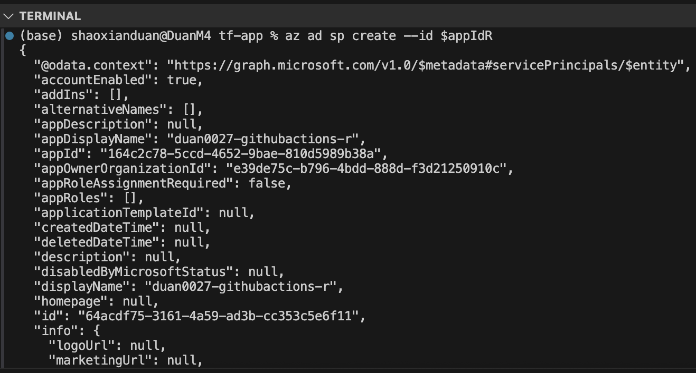

```bash
# Assign Reader role
az role assignment create \
  --role reader \
  --subscription $subscriptionId \
  --assignee-object-id $assigneeObjectId \
  --assignee-principal-type ServicePrincipal \
  --scope /subscriptions/$subscriptionId/resourceGroups/$resourceGroupName
```

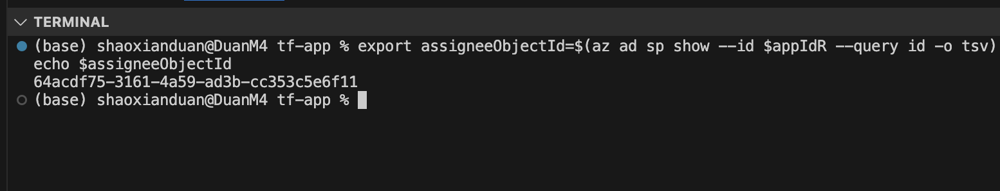

### 3.3 Create Federated Credentials

#### Production Deploy Credential

**File:** `infra/az-federated-credential-params/production-deploy.json`

```json
{
  "name": "production-deploy",
  "issuer": "https://token.actions.githubusercontent.com",
  "subject": "repo:duan0027/cst8918-w25-lab12:environment:production",
  "description": "CST8918 Lab12 - GitHub Actions",
  "audiences": ["api://AzureADTokenExchange"]
}
```

```bash
cd infra
az ad app federated-credential create \
  --id $appIdRW \
  --parameters az-federated-credential-params/production-deploy.json
```

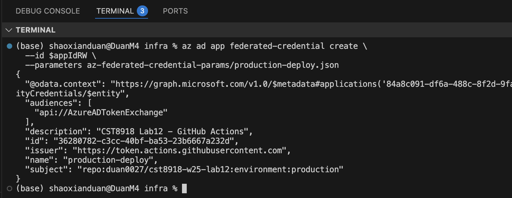

#### Pull Request Credential

**File:** `infra/az-federated-credential-params/pull-request.json`

```json
{
  "name": "pull-request",
  "issuer": "https://token.actions.githubusercontent.com",
  "subject": "repo:duan0027/cst8918-w25-lab12:pull_request",
  "description": "CST8918 Lab12 - GitHub Actions",
  "audiences": ["api://AzureADTokenExchange"]
}
```

```bash
az ad app federated-credential create \
  --id $appIdR \
  --parameters az-federated-credential-params/pull-request.json
```

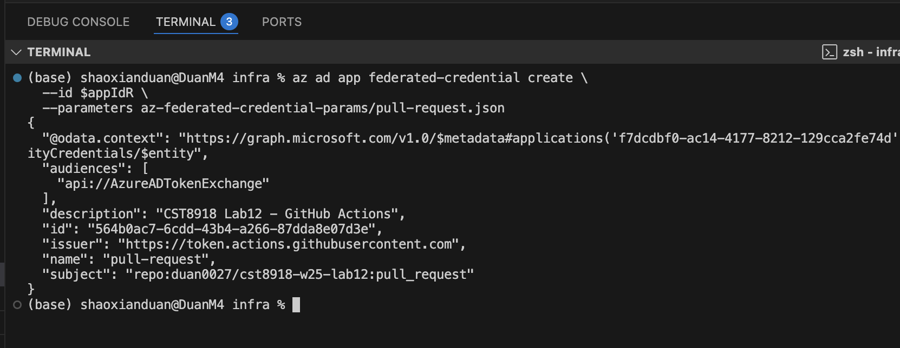

#### Branch Main Credential

**File:** `infra/az-federated-credential-params/branch-main.json`

```json
{
  "name": "branch-main",
  "issuer": "https://token.actions.githubusercontent.com",
  "subject": "repo:duan0027/cst8918-w25-lab12:ref:refs/heads/main",
  "description": "CST8918 Lab12 - GitHub Actions",
  "audiences": ["api://AzureADTokenExchange"]
}
```

```bash
az ad app federated-credential create \
  --id $appIdR \
  --parameters az-federated-credential-params/branch-main.json
```

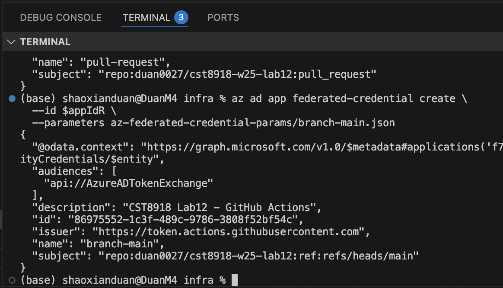

#### Verify Federated Credentials

```bash
az ad app federated-credential list --id $appIdRW --query "[].name" -o tsv
az ad app federated-credential list --id $appIdR --query "[].name" -o tsv
```

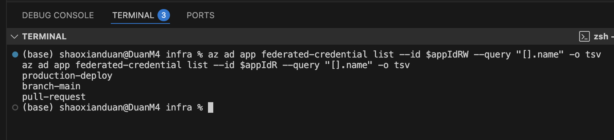

---

## GitHub Secrets Configuration

### 4.1 Configure Repository Secrets

1. Go to **Settings > Secrets and variables > Actions > New repository secret**
2. Add the following secrets:
   - `AZURE_CLIENT_ID`: Your Azure AD application client ID
   - `AZURE_TENANT_ID`: Your Azure tenant ID
   - `AZURE_SUBSCRIPTION_ID`: Your Azure subscription ID

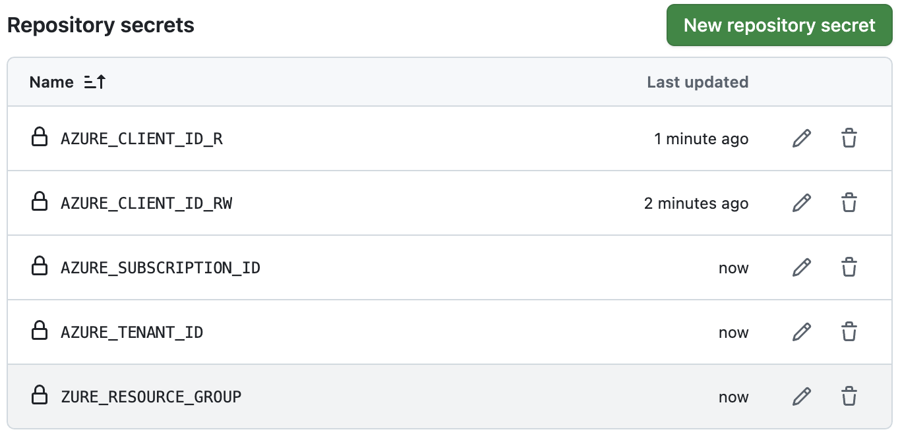

### 4.2 Configure Environment

1. Go to **Settings > Environments > New environment**
2. Create a `production` environment

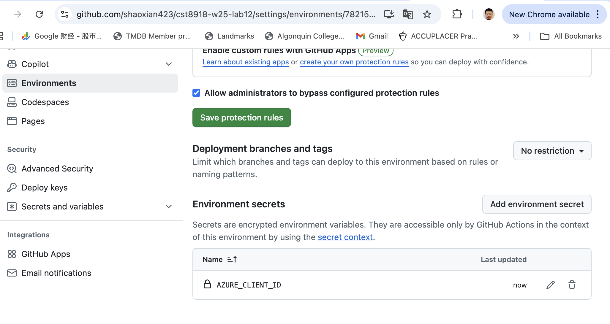

### 4.3 Verify Configuration

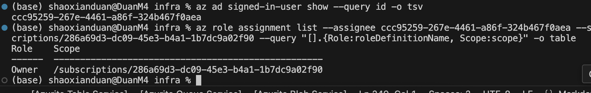

---

## GitHub Actions Workflows

### 5.1 Static Tests Workflow

**File:** `.github/workflows/infra-static-tests.yml`

```yaml
name: Terraform Static Tests

on: [push]

jobs:
  static-tests:
    runs-on: ubuntu-latest
    steps:
      - uses: actions/checkout@v3
      - uses: hashicorp/setup-terraform@v2
      - run: terraform -chdir=infra/tf-app init -backend=false
      - run: terraform -chdir=infra/tf-app fmt -check
      - run: terraform -chdir=infra/tf-app validate
      - uses: terraform-linters/setup-tflint@v3
      - run: tflint -chdir=infra/tf-app
```

### 5.2 CI/CD Workflow

**File:** `.github/workflows/infra-ci-cd.yml`

```yaml
name: Terraform CI/CD

on:
  pull_request:
    branches: [main]
  push:
    branches: [main]

jobs:
  plan:
    if: github.event_name == 'pull_request'
    runs-on: ubuntu-latest
    permissions:
      id-token: write
      contents: read
      pull-requests: write
    steps:
      - uses: actions/checkout@v3
      - uses: azure/login@v1
        with:
          client-id: ${{ secrets.AZURE_CLIENT_ID }}
          tenant-id: ${{ secrets.AZURE_TENANT_ID }}
          subscription-id: ${{ secrets.AZURE_SUBSCRIPTION_ID }}
      - uses: hashicorp/setup-terraform@v2
      - run: terraform -chdir=infra/tf-app init
      - run: terraform -chdir=infra/tf-app plan -out=plan.tfplan
      - name: Comment Terraform Plan
        uses: actions/github-script@v6
        with:
          script: |
            const plan = await require('child_process').execSync('terraform -chdir=infra/tf-app show -no-color plan.tfplan').toString();
            github.rest.issues.createComment({
              issue_number: context.issue.number,
              owner: context.repo.owner,
              repo: context.repo.repo,
              body: `Terraform Plan:\n\`\`\`\n${plan}\n\`\`\``
            });

  apply:
    if: github.event_name == 'push' && github.ref == 'refs/heads/main'
    runs-on: ubuntu-latest
    environment: production
    permissions:
      id-token: write
      contents: read
    steps:
      - uses: actions/checkout@v3
      - uses: azure/login@v1
        with:
          client-id: ${{ secrets.AZURE_CLIENT_ID }}
          tenant-id: ${{ secrets.AZURE_TENANT_ID }}
          subscription-id: ${{ secrets.AZURE_SUBSCRIPTION_ID }}
      - uses: hashicorp/setup-terraform@v2
      - run: terraform -chdir=infra/tf-app init
      - run: terraform -chdir=infra/tf-app apply -auto-approve
```

### 5.3 Drift Detection Workflow

**File:** `.github/workflows/infra-drift-detection.yml`

```yaml
name: Terraform Drift Detection

on:
  schedule:
    - cron: '0 0 * * *'  # Daily

jobs:
  drift:
    runs-on: ubuntu-latest
    permissions:
      id-token: write
      contents: read
    steps:
      - uses: actions/checkout@v3
      - uses: azure/login@v1
        with:
          client-id: ${{ secrets.AZURE_CLIENT_ID }}
          tenant-id: ${{ secrets.AZURE_TENANT_ID }}
          subscription-id: ${{ secrets.AZURE_SUBSCRIPTION_ID }}
      - uses: hashicorp/setup-terraform@v2
      - run: terraform -chdir=infra/tf-app init
      - run: terraform -chdir=infra/tf-app plan -detailed-exitcode
        continue-on-error: true
```

### 5.4 Push Code and Test Workflows

```bash
git add .
git commit -m "Remove .tfstate files from history and update workflows"
git push origin main --force
```

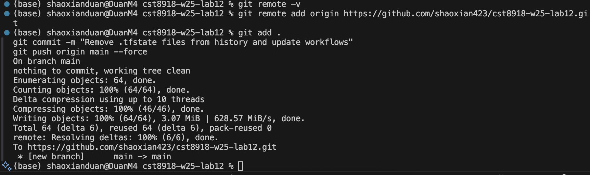

```bash
# Create dev branch
git checkout -b dev
git push origin dev
```

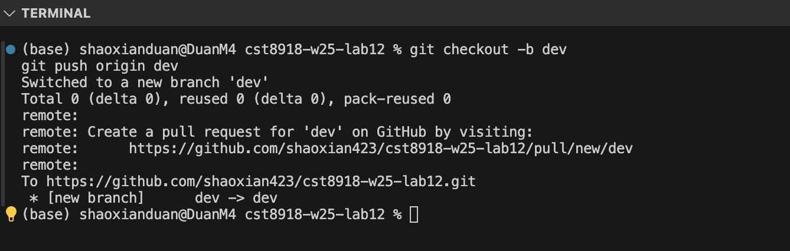

#### Pull Request

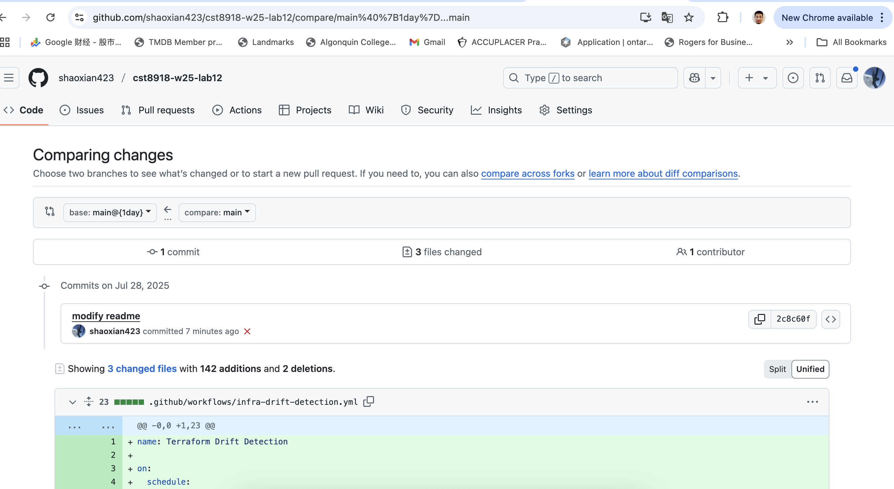

```bash
git push origin main
```


---

## Workflow Results

### 6.1 Terraform Static Tests Workflow

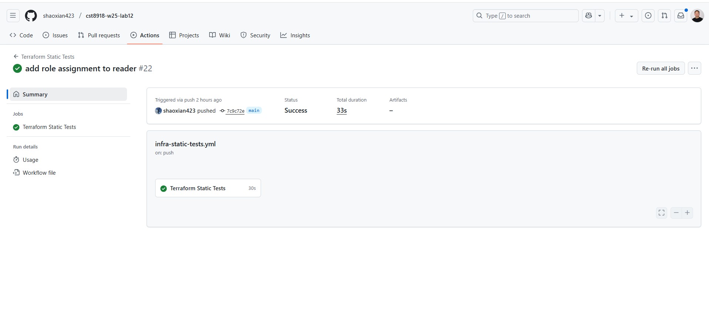

### 6.2 Terraform CI/CD Workflow

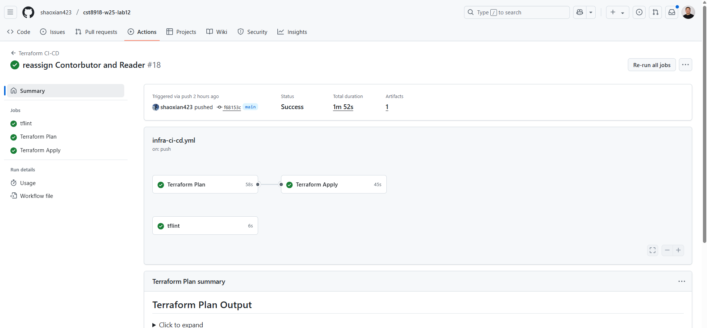

### 6.3 Terraform Drift Workflow
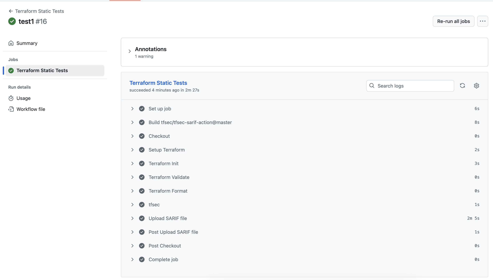
---

## Project Structure

```
cst8918-w25-lab12/
├── .github/
│   └── workflows/
│       ├── infra-static-tests.yml
│       ├── infra-ci-cd.yml
│       └── infra-drift-detection.yml
├── app/
│   └── .gitkeep
├── infra/
│   ├── tf-app/
│   │   ├── main.tf
│   │   ├── outputs.tf
│   │   ├── terraform.tf
│   │   ├── variables.tf
│   │   └── .tflint.hcl
│   ├── tf-backend/
│   │   └── main.tf
│   └── az-federated-credential-params/
│       ├── branch-main.json
│       ├── production-deploy.json
│       └── pull-request.json
├── screenshots/
│   └── [screenshot files]
├── .editorconfig
├── .gitignore
└── README.md
```

---

## Summary

This project demonstrates a complete CI/CD pipeline for Terraform infrastructure using:

- **Azure Storage Backend** for Terraform state management
- **GitHub Actions** for automated testing and deployment
- **Azure AD Federated Credentials** for secure authentication
- **Terraform** for infrastructure as code
- **Static analysis** with `tflint` and `terraform fmt`
- **Drift detection** for infrastructure monitoring

The setup includes proper security practices with OIDC authentication and role-based access control in Azure.