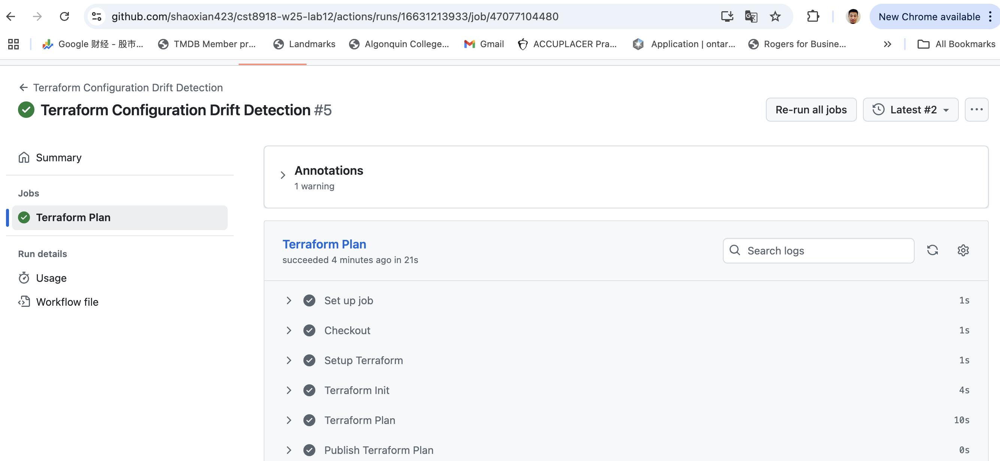

**1-github-settings.md**
# create folders
mkdir -p .github/workflows
mkdir -p app
mkdir -p infra/tf-app
mkdir -p infra/tf-backend
mkdir -p infra/az-federated-credential-params
mkdir -p screenshots

# create files
touch app/.gitkeep
touch infra/tf-app/.tflint.hcl
touch infra/tf-app/main.tf
touch infra/tf-app/outputs.tf
touch infra/tf-app/terraform.tf
touch infra/tf-app/variables.tf
touch infra/tf-backend/main.tf
touch infra/az-federated-credential-params/branch-main.json
touch infra/az-federated-credential-params/production-deploy.json
touch infra/az-federated-credential-params/pull-request.json
touch .editorconfig
touch .gitignore
touch README.md

mkdir -p .github/workflows

# create GitHub Actions workflows files
touch .github/workflows/infra-static-tests.yml
touch .github/workflows/infra-ci-cd.yml
touch .github/workflows/infra-drift-detection.yml

**2-terraform-backend.md**

# infra/tf-backend/main.tf
terraform {
  required_providers {
    azurerm = {
      source  = "hashicorp/azurerm"
      version = "~> 3.0"
    }
  }

  required_version = ">= 1.1.0"
}

provider "azurerm" {
  features {}
  use_oidc = true  # 启用 OIDC 认证，支持 GitHub Actions
}

resource "azurerm_resource_group" "rg" {
  name     = "duan0027-githubactions-rg"
  location = "Canada Central"
}

resource "azurerm_storage_account" "sa" {
  name                     = "duan0027githubactions25"  # 新名称，确保唯一
  resource_group_name      = azurerm_resource_group.rg.name
  location                 = azurerm_resource_group.rg.location
  account_tier             = "Standard"
  account_replication_type = "LRS"
  min_tls_version          = "TLS1_2"
}

resource "azurerm_storage_container" "tfstate" {
  name                  = "tfstate"
  storage_account_name  = azurerm_storage_account.sa.name
  container_access_type = "private"
}

output "resource_group_name" {
  value = azurerm_resource_group.rg.name
}

output "storage_account_name" {
  value = azurerm_storage_account.sa.name
}

output "container_name" {
  value = azurerm_storage_container.tfstate.name
}

output "arm_access_key" {
  value     = azurerm_storage_account.sa.primary_access_key
  sensitive = true
}

#  cd infra/tf-backend
terraform init
terraform fmt
terraform validate
terraform plan -out=tf-backend.plan
terraform apply tf-backend.plan
export ARM_ACCESS_KEY=$(terraform output -raw arm_access_key)

# cd ../tf-app/
terraform init -reconfigure
terraform fmt
terraform validate
terraform plan -out=tf-app.plan
terraform apply tf-app.plan

# infra/tf-app/terraform.tf

terraform {
  required_providers {
    azurerm = {
      source  = "hashicorp/azurerm"
      version = "~> 3.0"
    }
  }

  backend "azurerm" {
    resource_group_name  = "duan0027-githubactions-rg"
    storage_account_name = "duan0027githubactions25" # 匹配新名称
    container_name       = "tfstate"
    key                  = "terraform.tfstate"
  }
}

provider "azurerm" {
  features {}
  use_oidc = true # 启用 OIDC
}

# add main.tf

resource "azurerm_resource_group" "app_rg" {
  name     = "duan0027-a12-rg"
  location = "Canada Central"
}

**3-azure-credentials.md**

export subscriptionId=$(az account show --query id -o tsv)
export tenantId=$(az account show --query tenantId -o tsv)

echo $subscriptionId 
echo $tenantId       

export resourceGroupName=$(terraform output -raw resource_group_name)
export resourceGroupName="duan0027-a12-rg"

# creating Azure AD application
az ad app create --display-name duan0027-githubactions-rw

# set env
export subscriptionId=286a69d3-dc09-45e3-b4a1-1b7dc9a02f90
export tenantId=e39de75c-b796-4bdd-888d-f3d21250910c
export resourceGroupName=duan0027-a12-rg
# save appleID
export appIdRW=3b3dd36a-923d-4b7c-8831-0a95804e5cab
# Creat Service
az ad sp create --id $appIdRW

# Get objectID
export assigneeObjectId=$(az ad sp show --id $appIdRW --query id -o tsv)
echo $assigneeObjectId 

# Assign the Contributor role: Assign the Contributor role to duan0027-a12-rg
az role assignment create \
  --role contributor \
  --subscription $subscriptionId \
  --assignee-object-id $assigneeObjectId \
  --assignee-principal-type ServicePrincipal \
  --scope /subscriptions/$subscriptionId/resourceGroups/$resourceGroupName
  
# verify：
az role assignment list --scope /subscriptions/$subscriptionId/resourceGroups/$resourceGroupName --query "[?roleDefinitionName=='Contributor'].{Principal:principalName}" -o table
  
# Create a Reader role application and service principal
az ad app create --display-name duan0027-githubactions-r

export appIdR=164c2c78-5ccd-4652-9bae-810d5989b38a

# Create a service principal
az ad sp create --id $appIdR

export assigneeObjectId=$(az ad sp show --id $appIdR --query id -o tsv)
echo $assigneeObjectId  

# Assign Reader Role
az role assignment create \
  --role reader \
  --subscription $subscriptionId \
  --assignee-object-id $assigneeObjectId \
  --assignee-principal-type ServicePrincipal \
  --scope /subscriptions/$subscriptionId/resourceGroups/$resourceGroupName
  
# Create three Federated Credentials
# infra/az-federated-credential-params/production-deploy.json
{
  "name": "production-deploy",
  "issuer": "https://token.actions.githubusercontent.com",
  "subject": "repo:duan0027/cst8918-w25-lab12:environment:production",
  "description": "CST8918 Lab12 - GitHub Actions",
  "audiences": ["api://AzureADTokenExchange"]
}
# Creat Credentials 1
cd infra
az ad app federated-credential create \
  --id $appIdRW \
  --parameters az-federated-credential-params/production-deploy.json

# infra/az-federated-credential-params/pull-request.json：
{
  "name": "pull-request",
  "issuer": "https://token.actions.githubusercontent.com",
  "subject": "repo:duan0027/cst8918-w25-lab12:pull_request",
  "description": "CST8918 Lab12 - GitHub Actions",
  "audiences": ["api://AzureADTokenExchange"]
}
# Creat Credentials 2
az ad app federated-credential create \
  --id $appIdR \
  --parameters az-federated-credential-params/pull-request.json
  
# infra/az-federated-credential-params/branch-main.json：
{
  "name": "branch-main",
  "issuer": "https://token.actions.githubusercontent.com",
  "subject": "repo:duan0027/cst8918-w25-lab12:ref:refs/heads/main",
  "description": "CST8918 Lab12 - GitHub Actions",
  "audiences": ["api://AzureADTokenExchange"]
}
# Creat Credentials 3
az ad app federated-credential create \
  --id $appIdR \
  --parameters az-federated-credential-params/branch-main.json
  
# Verify
az ad app federated-credential list --id $appIdRW --query "[].name" -o tsv
az ad app federated-credential list --id $appIdR --query "[].name" -o tsv

**4. GitHub Secrets.md**
# Settings > Secrets and variables > Actions > New repository secret

# Settings > Environments > New environment

# verify

# Test GitHub Actions workflow
# infra-static-tests.yml
name: Terraform Static Tests

on: [push]

jobs:
  static-tests:
    runs-on: ubuntu-latest
    steps:
      - uses: actions/checkout@v3
      - uses: hashicorp/setup-terraform@v2
      - run: terraform -chdir=infra/tf-app init -backend=false
      - run: terraform -chdir=infra/tf-app fmt -check
      - run: terraform -chdir=infra/tf-app validate
      - uses: terraform-linters/setup-tflint@v3
      - run: tflint -chdir=infra/tf-app
# infra-ci-cd.yml
name: Terraform CI/CD

on:
  pull_request:
    branches: [main]
  push:
    branches: [main]

jobs:
  plan:
    if: github.event_name == 'pull_request'
    runs-on: ubuntu-latest
    permissions:
      id-token: write
      contents: read
      pull-requests: write
    steps:
      - uses: actions/checkout@v3
      - uses: azure/login@v1
        with:
          client-id: ${{ secrets.AZURE_CLIENT_ID }}
          tenant-id: ${{ secrets.AZURE_TENANT_ID }}
          subscription-id: ${{ secrets.AZURE_SUBSCRIPTION_ID }}
      - uses: hashicorp/setup-terraform@v2
      - run: terraform -chdir=infra/tf-app init
      - run: terraform -chdir=infra/tf-app plan -out=plan.tfplan
      - name: Comment Terraform Plan
        uses: actions/github-script@v6
        with:
          script: |
            const plan = await require('child_process').execSync('terraform -chdir=infra/tf-app show -no-color plan.tfplan').toString();
            github.rest.issues.createComment({
              issue_number: context.issue.number,
              owner: context.repo.owner,
              repo: context.repo.repo,
              body: `Terraform Plan:\n\`\`\`\n${plan}\n\`\`\``
            });

  apply:
    if: github.event_name == 'push' && github.ref == 'refs/heads/main'
    runs-on: ubuntu-latest
    environment: production
    permissions:
      id-token: write
      contents: read
    steps:
      - uses: actions/checkout@v3
      - uses: azure/login@v1
        with:
          client-id: ${{ secrets.AZURE_CLIENT_ID }}
          tenant-id: ${{ secrets.AZURE_TENANT_ID }}
          subscription-id: ${{ secrets.AZURE_SUBSCRIPTION_ID }}
      - uses: hashicorp/setup-terraform@v2
      - run: terraform -chdir=infra/tf-app init
      - run: terraform -chdir=infra/tf-app apply -auto-approve
# infra-drift-detection.yml
name: Terraform Drift Detection

on:
  schedule:
    - cron: '0 0 * * *'  # Daily

jobs:
  drift:
    runs-on: ubuntu-latest
    permissions:
      id-token: write
      contents: read
    steps:
      - uses: actions/checkout@v3
      - uses: azure/login@v1
        with:
          client-id: ${{ secrets.AZURE_CLIENT_ID }}
          tenant-id: ${{ secrets.AZURE_TENANT_ID }}
          subscription-id: ${{ secrets.AZURE_SUBSCRIPTION_ID }}
      - uses: hashicorp/setup-terraform@v2
      - run: terraform -chdir=infra/tf-app init
      - run: terraform -chdir=infra/tf-app plan -detailed-exitcode
        continue-on-error: true
#  push code：
(base) shaoxianduan@DuanM4 cst8918-w25-lab12 % git add .
git commit -m "Remove .tfstate files from history and update workflows"
git push origin main --force

#  create dev branch
git checkout -b dev
git push origin dev

# Pull Request

# git push origin main

# CST8918-W25-Lab12
## Team Members
- Shaoxian Duan (GitHub: shaoxian423)
- [Xihai Ren] (GitHub: ...)
- Mishravaibhav0032 (GitHub: ...)
-Date jul 30